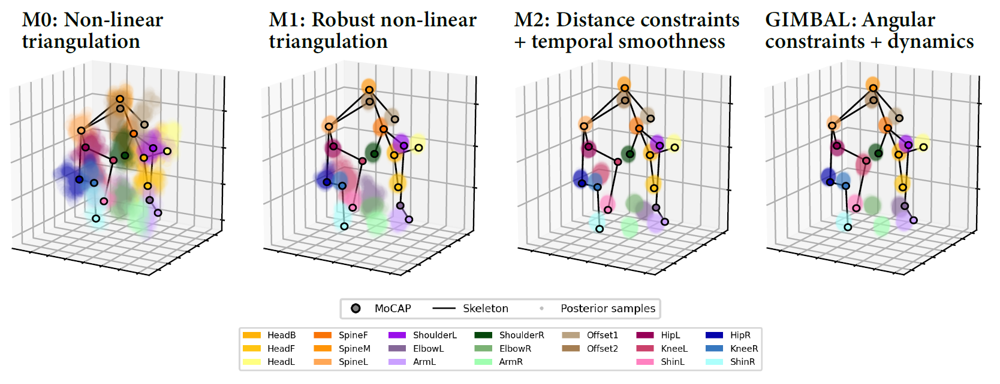

# GIMBAL: GeometrIc Manifolds for Body Articulation and Localization

GIMBAL is an animal pose estimation model that uses recent advances in spherical manifold learning to capture the spatiotemporal constraints of body posture
to **accurately infer latent 3D keypoint positions** from 2D or 3D keypoint observations.
This model is applicable to animals with rigid, articulated skeletons.

GIMBAL employs a hierarchical von Mises-Fisher-Gaussian model (h-vMFG) to capture distance, directional, and temporal constraints.
It admits a simple Monte Carlo Markov Chain (MCMC) algorithm for approximate Bayesian inference that
produces posterior estimates and variances of 3D positions, joint directions, heading (relative to user-defined direction), and pose state.



## Installation
GIMBAL uses Python 3.5 and above.
It can run on both a CPU or a CUDA-enabled GPU (and associated drivers),
although it runs much faster on the latter.
It relies primarily on
[JAX](https://github.com/google/jax) and
[TensorFlow Probability on JAX](https://www.tensorflow.org/probability/examples/TensorFlow_Probability_on_JAX) (which does not depend on TensorFlow).

The default requirements are targeted towards running on a CPU.
GPU-specific instructions are only required for installing the `jax` package;
please see JAX's [installation guide](https://github.com/google/jax#installation)
for the most recent details.

## Reference
To cite this work, please reference the associated paper
which was presented at [AI Stats 2021](http://proceedings.mlr.press/v130/zhang21h.html):
```
@InProceedings{pmlr-v130-zhang21h,
  title = 	 { Animal pose estimation from video data with a hierarchical von Mises-Fisher-Gaussian model },
  author =       {Zhang, Libby and Dunn, Tim and Marshall, Jesse and Olveczky, Bence and Linderman, Scott},
  booktitle = 	 {Proceedings of The 24th International Conference on Artificial Intelligence and Statistics},
  pages = 	 {2800--2808},
  year = 	 {2021},
  editor = 	 {Arindam Banerjee and Kenji Fukumizu},
  volume = 	 {130},
  series = 	 {Proceedings of Machine Learning Research},
  month = 	 {13--15 Apr},
  publisher =    {PMLR},
  pdf = 	 {http://proceedings.mlr.press/v130/zhang21h/zhang21h.pdf},
  url = 	 {http://proceedings.mlr.press/v130/zhang21h.html},
}
```